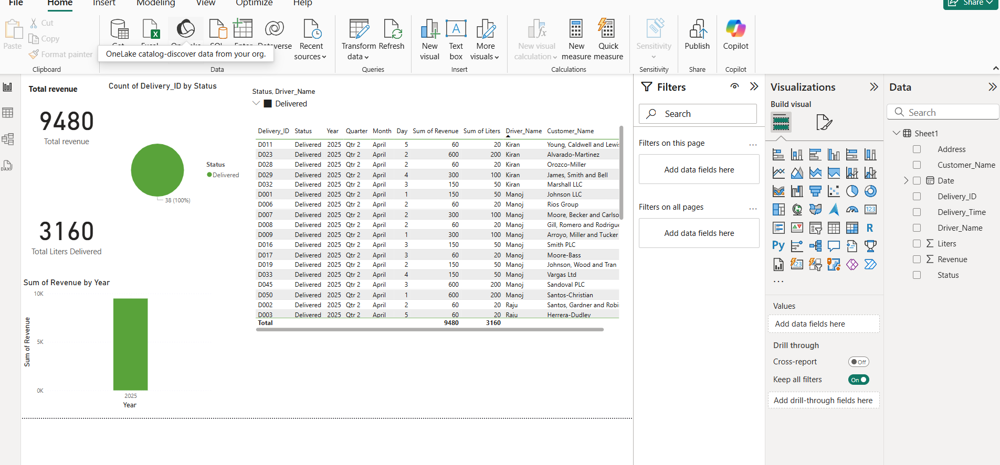

# 💧 Water Delivery Business Dashboard

This project showcases a complete **data analytics workflow** for a local water delivery business. It involves data cleaning using **Python (Pandas)** and building an interactive dashboard using **Power BI**.

---

## 📁 Project Structure

- `water_delivery_cleaning.py` – Python script for cleaning raw delivery data  
- `cleaned_water_delivery_data.xlsx` – Output file after cleaning  
- `WaterDashboard.pbix` – Power BI file containing the dashboard  
- `README.md` – Project overview and documentation  

---

## 🔧 Tools & Technologies

- **Python** (Pandas, Faker)  
- **Power BI**  
- **Git & GitHub**  
- **Excel (.xlsx)**  

---

## 🧹 Data Cleaning (Python)

Used `pandas` to:
- Remove null/missing driver names and delivery times  
- Calculate revenue based on liters delivered  
- Standardize column formats  
- Export cleaned data to Excel  

---

## 📊 Dashboard Features (Power BI)

- **Total Revenue & Liters Delivered (Cards)**  
- **Daily Revenue Trend (Bar Chart)**  
- **Delivery Status Breakdown (Donut Chart)**  
- **Detailed Delivery Table**  
- **Slicers to filter by Driver & Status**  

---

## 📸 Preview

---

## 🚀 How to Use

1. Clone the repository or download files  
2. Run `water_delivery_cleaning.py` to generate cleaned data  
3. Open `WaterDashboard.pbix` in Power BI  
4. Explore and interact with the dashboard  

---

## 📌 Author

**Naga Satya Sai Teja Boidi**  
[GitHub Profile](https://github.com/saitejaboidi)

---

## ⭐ Project Status

✅ Completed – Ready for portfolio and sharing with recruiters!

